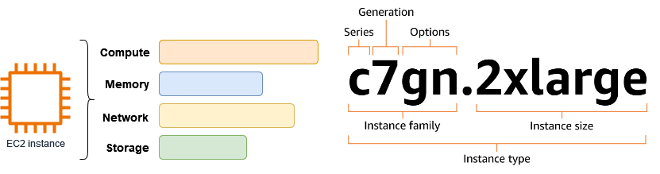
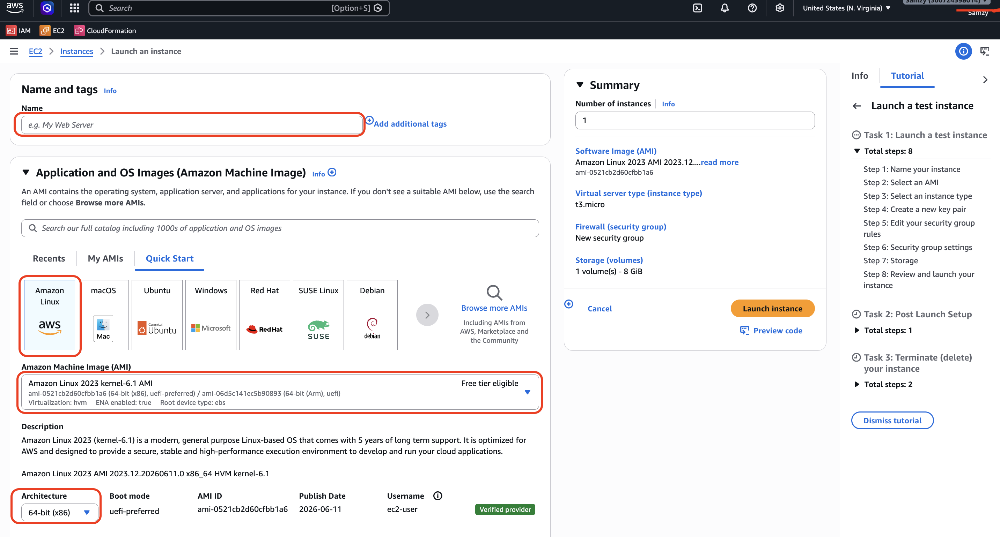
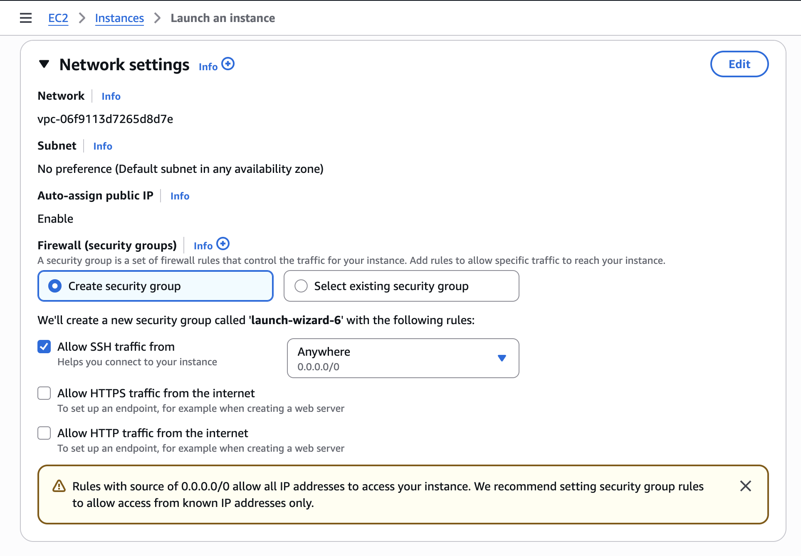
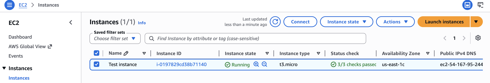
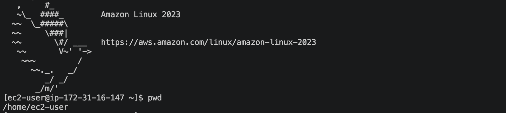
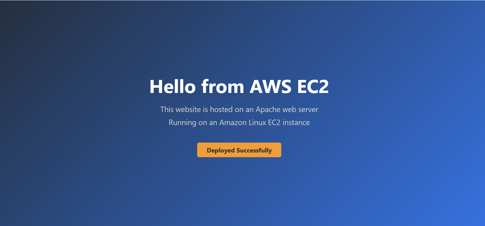
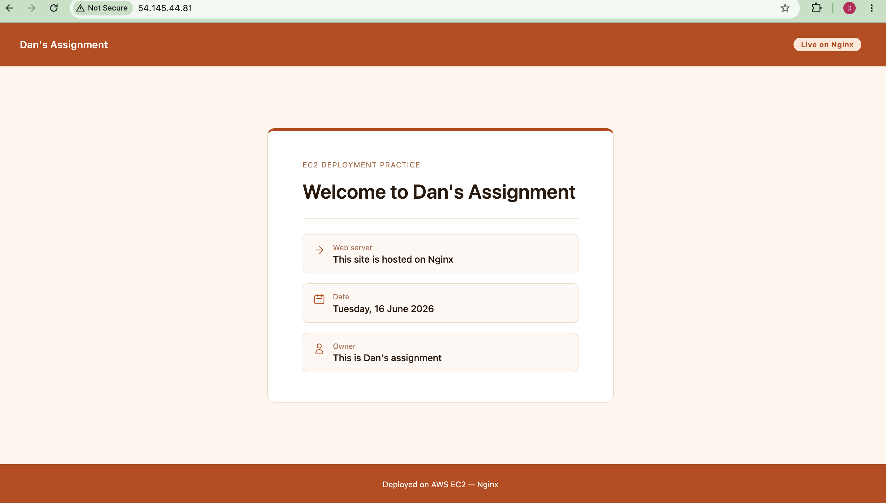

### **CREATING AND CONNECTING TO AN EC2 INSTANCE**
##

The Amazon EC2 (Elastic Cloud Compute) is a service on AWS that allows you create, access and use virtual computer in the cloud.


An EC2 instance is the actual virtual server you create using the EC2 service. An EC2 instance basically comprises the following; 

1. CPU (processing power)
2. RAM (memory)
3. Disk (storage space)
4. Operating System (Windows, Linux, etc)


\
And just like a regular computer, you can start (launch) an instance, stop, terminate and reboot too. 

EC2 instances fall under various suggestive categories such as; 
* general instances
* compute optimized
* storage optimized
* memory optimized
* accelerated compute instance


\
 

\
You can simply identify instance type or categories is based off their names.

Instance names are a combination of the instance family, generation and size. A good example is the t3.micro. They can also indicate additional capabilities and features such as specific processor type or optimised networking performance.

##
**LAUNCHING AND CONNECTING AN EC2 INSTANCE**

*(A hands-on guide to launching an EC2 instance from the AWS console)*

##

Having defined and explained what an EC2 instance is, we shall now proceed to launching on directly from the AWS console and them go a step further by connecting it via SSH on Linux. 

It’s a pretty straightforward process and quite easy to understand as well. Also, since this is a test launch, we’d be going with the basic selections for everything (general purpose instance, default settings, etc).

\
**LAUNCHING THE INSTANCE**
1. Login to the AWS console and from the dashboard, select ‘EC2'
2. Now in the EC2 tab, you want to select ‘Launch Instance’ 
3. Fill in your Instance name and leave the the options as default as highlighted in the image below.

 

4. Select Instance type (t3.micro)


5. Create a new key pair with the .pem format.
6. Now, we have to select and edit our network and security group but for the purpose of this exercise, they shall all be left as default as highlighted in the image below but for actual work, it is important to carefully create a security group solely for that specific instance. 



7. Perform a quick overlook to make sure everything is as they should be and then go ahead to launch the instance. 

\
After successfully launching the instance, we can now access it by selecting **‘View All Instances’** at the bottom of the page and we should see our newly created instance there. We need to wait for a couple of minutes for the health checks to be passed successfully for it is only after this point we can confidently say an EC2 instance has been launched. 


##

**CONNECTING TO THE INSTANCE**

After launching and verifying the instance is healthy and running, we can now proceed to connecting via SSH client. 

1. Select the instance by clicking the empty box beside the instance name and then choose ‘connect’.



2. After selecting ‘connect’, some options would appear upon which you are to select SSH Client and then follow the instructions to connect your instance.

\
Upon following the instructions accordingly, to confirm success of the actions, you should see something resembling the image below in your terminal. 




\
***NB; The commands should be done via your terminal and under your Downloads folder where you have you key pair saved.***


And that's pretty much it. We have successfully launched an instance and connected to it. 
##

## **HOSTING SIMPLE WEBSITES USING APACHE & NGINGX**

Now that we have successfully launched and connected to the instance, we would now proceed to deoloying a website by configuring both Apache and Nginx web servers.


#### **LAUNCH USING APACHE**
Before going ahead with deploying on Apache, it must first be installed and that can be done using the following commands;

``` 
sudo dnf update -y
sudo dnf install -y httpd
```
After confirming the installation, the next thing to do is start and enable apache and you can do that with the commands below;

```
sudo systemctl start httpd
sudo systemctl enable httpd
```
It should be up and running now but confirm with `sudo system status httpd`. The text should now say 'enabled' instead of 'disabled' and also 'active'

Now that we've got apache up and running, there's one extra layer of confirmation (this would be used for the final result as well). You want to copy your public IP address of your instance and load it in your browser using http as the URL prefix so it looks something like `http://<your-ec2-public-ip>`. 

You should get a default message like "It works". That confirms you are on the right path. 

### Troubleshooting Tip
```
If you encounter errors opening the public IP page in your browser, go back to the security group attached to your instance and confirm that under inbound rules, you have your HTTP with Port range 80 allowed and the source is set to 'anywhere'. It should work fine after
```
##

\
The next thing to do now is to replace the default apache page with our own website. 

To do that, run `sudo vim /var/www/html/index.html` and then paste the contents of the index.html file attached to this repo, save and exit. 

What we just did is we edited the default apache page that's stored in var/www/html/ using Vim and replaced it with our own page.

 Now, refresh the public IP address you loaded in your browser earlier and you should see something like this on your screen; 

 

##
 ### LAUNCH USING NGINX
 This process is quite similar to apache but with different commmands. 

Of course, we have to install nginx. Use the follwoing commands to do so;
```
sudo dnf update -y
sudo dnf install -y nginx
```
 Nginx should now be successfully installed but before we coontinue, we have to disable apache because it's currently running on our available HTTP port (you'll get an error message if you try to launch nginx without disabling apache). 

 To disable apache, run the following commands;

 ```
 sudo systemctl stop httpd
sudo systemctl disable httpd
```
Now that it's disabled, we can freely start and enable nginx.
```
sudo systemctl start nginx
sudo systemctl enable nginx
```
Everything should be working perfectly now but as usual, always confirm before proceeding. Use `sudo systemctl status nginx` to confirm. 

##
**DEPLOYING THE WEBSITE** 

Just like with apache, we would be editing the index.html file using Vim.  [*Attached to this repo is another index.html (index_3.html) file different from the oe=ne we used earlier with Apache just to give this whole process a different feel*]

To edit and replace the files, run `sudo vim /usr/share/nginx/html/index.html` , go back to your browser with the public IP and refresh and you should have this on your screen; 



And that's all about hosting websites using apache and nginx.